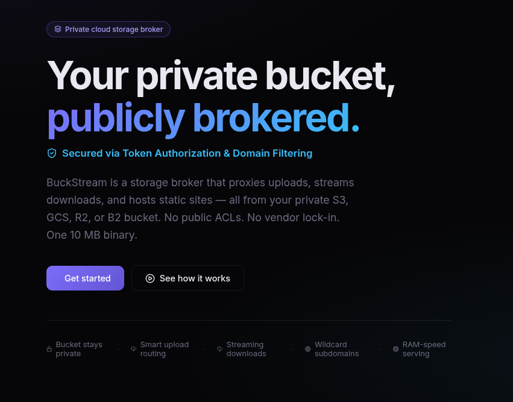
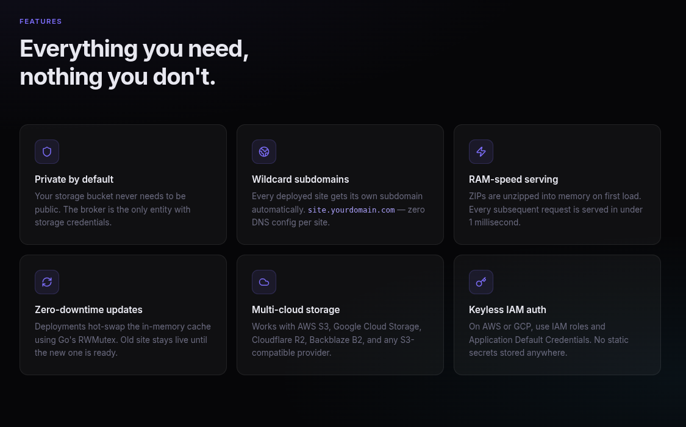
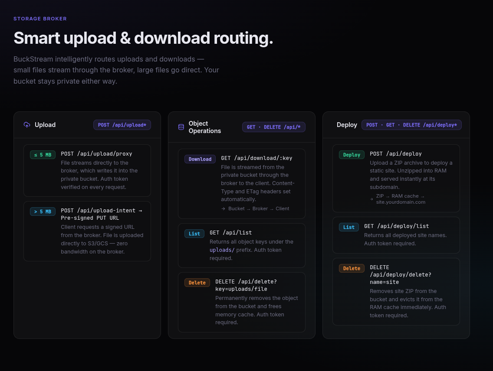
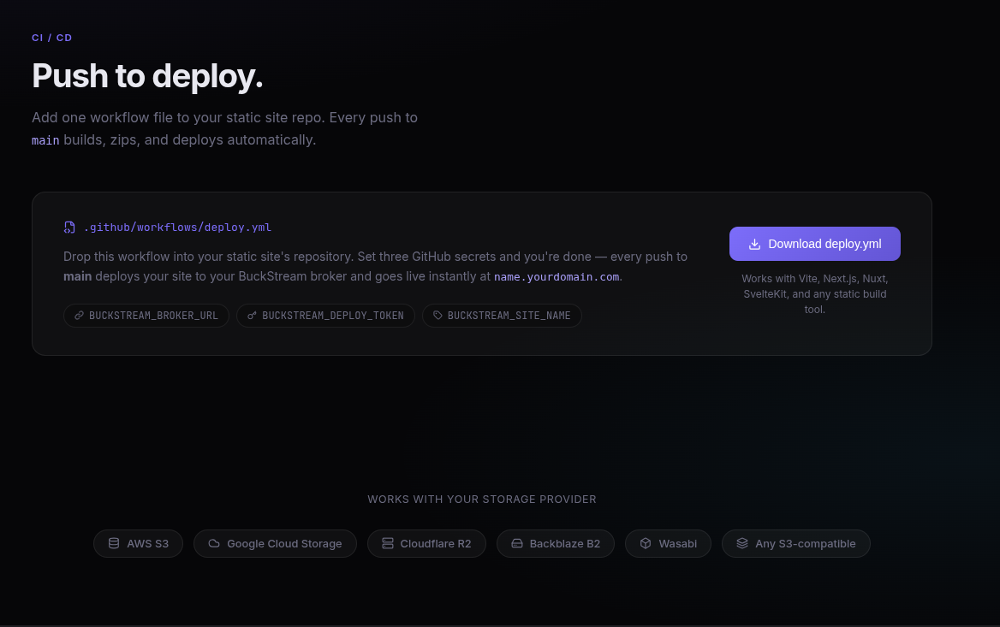
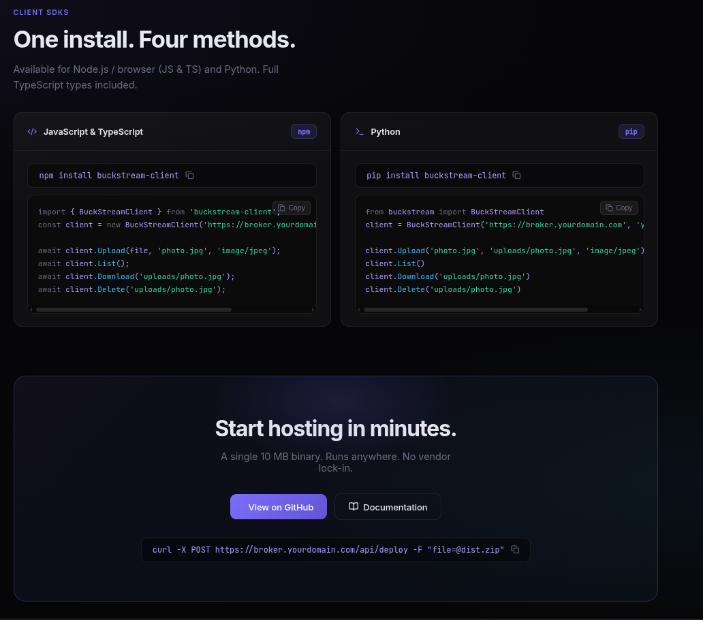

# ⚡ BuckStream

Run the Go server to see the full details of BuckStream at http://localhost:8080

> **Your private bucket, publicly brokered.** 

BuckStream is a lightweight, high-performance **Storage Broker and Static Site Hosting Gateway** packaged as a single 10 MB binary. It allows you to host static websites and proxy file uploads/downloads using a **completely private** storage bucket (AWS S3, Google Cloud Storage, Cloudflare R2, Backblaze B2, or any S3-compatible provider). 

*No public bucket ACLs. No static storage keys exposed to clients. Zero-downtime hot-swaps. RAM-speed serving (< 1ms).*



---

## 🚀 Key Features

*   **🔒 Zero-Trust Storage**: Keep your cloud storage bucket 100% private. All requests go through the broker, which handles authentication and authorization.
*   **🌐 Instant Wildcard Subdomains**: Automatically route subdomains to deployed sites (`site-name.yourdomain.com`). No DNS modification per site required.
*   **⚡ RAM-Speed Serving**: Static site ZIPs are downloaded and decompressed into memory (RAM) on first access or deployment. Subsequent requests are served in **under 1 millisecond**.
*   **🔄 Zero-Downtime Hot-Swaps**: Deploying updates hot-swaps the memory cache dynamically using Go's RWMutex. The old version remains live until the new cache is fully primed.
*   **🔀 Smart Upload Routing**:
    *   **Small Files (≤ 5MB)**: Streamed through the broker directly into the bucket (secure bearer authentication required).
    *   **Large Files (> 5MB)**: Bypasses broker bandwidth by automatically generating secure, 15-minute S3/GCS pre-signed upload URLs.
*   **☁️ Keyless IAM Integrations**: Native support for keyless IAM task roles on AWS and Application Default Credentials on GCP.



---

## 📐 Architecture

```
                           ┌─────────────────────────────────────────────┐
                           │            DNS / Cloudflare Worker          │
                           │   *.yourdomain.com  ─────────────→ Broker   │
                           └──────────────────────┬──────────────────────┘
                                                  │ (wildcard subdomain proxy)
                                                  ▼
                           ┌─────────────────────────────────────────────┐
                           │            BuckStream Go Broker             │
                           │  - Dynamic routing via Host header          │
                           │  - Blazing-fast serving from RAM cache      │
                           │  - On cache miss: pulls ZIP from bucket     │
                           └──────────────────────┬──────────────────────┘
                                                  │ (secure private connection)
                                                  ▼
                           ┌─────────────────────────────────────────────┐
                           │        Private Storage Bucket (S3/GCS)       │
                           │  - No public access or open ACLs            │
                           │  - Holds sites/zip and user uploads         │
                           └─────────────────────────────────────────────┘
```

---

## ⚙️ Environment Variables

Copy `env.example` to `.env` or set these in your hosting environment:

| Variable | Required | Default | Description |
| :--- | :--- | :--- | :--- |
| `BUCKET_NAME` | **Yes** | — | Target private S3 or GCS bucket |
| `DEPLOY_TOKEN` | **Yes (prod)** | — | Secret token required to push site deployments (`POST /api/deploy`) |
| `UPLOAD_TOKEN` | No | — | Secret token required for file uploads (`POST /api/upload-intent`) |
| `ALLOWED_DOMAINS` | No | `*` | CORS allowed origins (comma-separated list) |
| `S3_BY_IAM` | No | `false` | Enable to use keyless S3 IAM Roles (AWS ECS, EC2, Lambda) |
| `GCS_BY_IAM` | No | `false` | Enable to use keyless GCS Application Default Credentials (GCP) |
| `S3_COMPATIBLE_BY_TOKEN` | No | `false` | Enable static key credentials for R2, B2, Wasabi, etc. |
| `S3_COMPATIBLE_ENDPOINT` | Conditional | — | Target endpoint URL (e.g. `https://<account-id>.r2.cloudflarestorage.com`) |
| `S3_COMPATIBLE_ACCESS_KEY`| Conditional | — | Storage access key ID |
| `S3_COMPATIBLE_ACCESS_SECRET`| Conditional| — | Storage secret access key |

---

## ⚡ Quick Start

> [!TIP]
> **Zero-Setup Local S3 Storage**
> If you have a local Docker daemon running, you do not need to set up or configure an external cloud S3 bucket for local testing. BuckStream will automatically detect Docker, spin up a lightweight local **Garage S3** container, auto-configure the S3 credentials, and store all data locally on your disk.

### 1. Build and Run from Source
```bash
# Clone the repository
git clone https://github.com/Parthtiw710/buckstream.git
cd buckstream

# Run locally with hot reloading (requires air)
air

# Or build and run binary
go build -o bin/buckstream ./cmd/main.go
./bin/buckstream
```

### 2. Run with Docker
```bash
docker build -t buckstream:latest .

docker run -p 8080:8080 \
  -e S3_COMPATIBLE_BY_TOKEN=true \
  -e S3_COMPATIBLE_ENDPOINT=https://<id>.r2.cloudflarestorage.com \
  -e S3_COMPATIBLE_ACCESS_KEY=your_key \
  -e S3_COMPATIBLE_ACCESS_SECRET=your_secret \
  -e BUCKET_NAME=my-bucket \
  -e DEPLOY_TOKEN=my-deploy-token \
  buckstream:latest
```

### 3. Accessing the Dashboard & DNS Setup
Once BuckStream is running, open your browser and navigate to `http://localhost:8080` to see the full guide and interactive dashboard.

> [!IMPORTANT]
> **Wildcard Domain Requirement**
> To view and access static site deployments (e.g. when deployed on `domain.com`), configuring a wildcard domain is necessary. You must point `*.domain.com` to the same server/IP address as `domain.com`.

### 4. Running the Demo Playground
The `demo/` folder contains a Vite-based React client playground used to test and check your static site deployments and file uploads. To start it:

**Using npm:**
```bash
cd demo
npm install
npm run dev
```

**Using Bun:**
```bash
cd demo
bun install
bun run dev
```

---

## 📡 API Endpoints



### 🚀 Deploy a Static Site
Deploys a static site. The name of the ZIP file becomes the subdomain prefix (e.g. `blog.zip` → `blog.yourdomain.com`).
*   **Endpoint**: `POST /api/deploy`
*   **Headers**: `Authorization: Bearer <DEPLOY_TOKEN>`
*   **Body**: `multipart/form-data` with `file=@dist.zip`

### 📤 File Upload Intent
Negotiate upload strategy based on size.
*   **Endpoint**: `POST /api/upload-intent`
*   **Headers**: `Authorization: Bearer <UPLOAD_TOKEN>`
*   **Body** (`application/json`):
    ```json
    {
      "filename": "document.pdf",
      "content_type": "application/pdf",
      "size": 1542000
    }
    ```
*   **Response** (`action: "proxy"` or `action: "direct"` with a pre-signed URL).

### 📥 Stream / Download Files
Retrieve uploaded assets safely.
*   **Endpoint**: `GET /api/download/uploads/<filename>`
*   **Access**: Public (assets are streamed securely from the private bucket through the broker).

---

## 📦 GitHub Actions CI/CD Deployment



Add this workflow to your static site repositories (`.github/workflows/deploy.yml`) to automatically build and deploy on every push:

```yaml
name: Deploy to BuckStream

on:
  push:
    branches: [main]

jobs:
  deploy:
    name: Build & Deploy Static Site
    runs-on: ubuntu-latest
    steps:
      - name: Checkout
        uses: actions/checkout@v4

      - name: Set up Node.js
        uses: actions/setup-node@v4
        with:
          node-version: 20
          cache: npm

      - name: Install dependencies
        run: npm ci

      - name: Build static site
        run: npm run build

      - name: Zip build output
        run: |
          cd dist
          zip -r ../${{ secrets.BUCKSTREAM_SITE_NAME }}.zip .
          cd ..

      - name: Deploy to BuckStream broker
        run: |
          curl -f -X POST "${{ secrets.BUCKSTREAM_BROKER_URL }}/api/deploy" \
            -H "Authorization: Bearer ${{ secrets.BUCKSTREAM_DEPLOY_TOKEN }}" \
            -F "file=@${{ secrets.BUCKSTREAM_SITE_NAME }}.zip"
```

---

## 🔌 Client SDKs



### Isomorphic JavaScript SDK (Node.js & Bun)

The client SDK in `sdk/node/buckstream.js` works out of the box in browsers, Node.js (18+), and Bun. It leverages native, standard Web APIs (`fetch`, `Response`, `Blob`) and requires **zero external dependencies**.

```javascript
import { BuckStreamClient } from "./sdk/node/buckstream.js";

// Initialize client
const client = new BuckStreamClient("http://localhost:8080", "your_upload_token");

// Upload a file (accepts File, Blob, ArrayBuffer, or Buffer)
const result = await client.Upload(fileContent, "uploads/image.png", "image/png");
console.log("Upload result:", result);

// List uploaded files
const listResult = await client.List();
console.log("Files:", listResult.objects);
```

## 📄 License

This project is licensed under the Apache License, Version 2.0. See [LICENSE](LICENSE) for details.

Developed with ⚡ by **ArcOps — Agentic Multi-Cloud Intelligence**.
